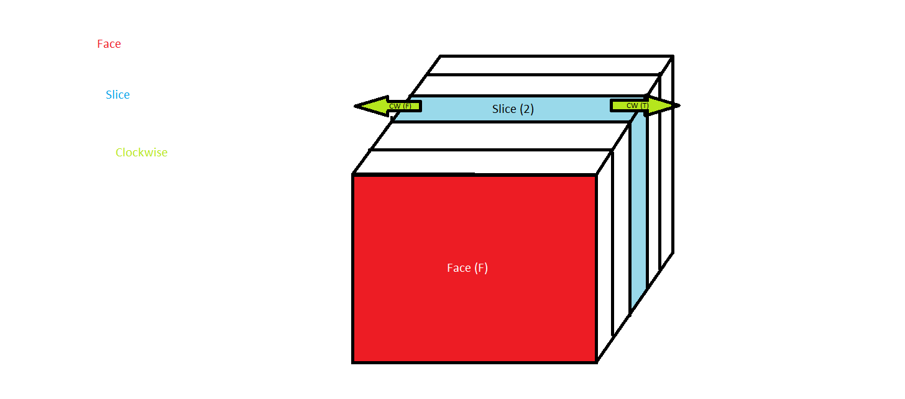
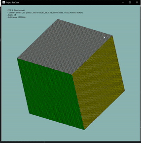

# Project BigCube (Generalized Higher Dimension Rubick's Cubes)

This project is to implement a deep-reinforcement model on a rubicks cube, then compare the cost/benefit of training networks on higher dimensions vs. algorithmically reducing down the dimension of the cube and applying a smaller, already learned network. Graphics were rendered using [Orthographics](https://github.com/TheNightly/OrthoGraphics/tree/master), my own custom graphics engine for specifically this project. If you want to read more about that part of the project, read more about it [here](https://github.com/TheNightly/OrthoGraphics/tree/master).

## Abstraction
For a traditional 3x3x3 rubick's cube, all the moves can be quantified as (relative to a certain face), picking a direction from the center of the cube (**U**p **L**eft **R**ight **D**own **F**ront **B**ack) and which direction to rotate that face. Generally clockwise is the default and counterclockwise turns are represented with a ' mark. For example, turning the top face clockwise is just **U** and counterclockwise is **U'**. 

However, this formulation falls apart as soon as you add even one higher dimension to the cube. There are cube turns and middle moves, but I want rotation invariance and not an overwhelmingly large number of middle moves. As such, the formulation of moves inside this project will be specified by a tuple of the following format (face, slice_index), where face is one of **U**p, **L**eft, **R**ight, **D**own, **F**ront, **B**ack just like before, and slice index now indicates the number of slices from that face to turn. For example (R, 0) indicates that we are turning the right face. Below is a graphical example as well.

*Example of this notation*

Originally, this tuple included one more value, which was a boolean specifying whether the turn is clockwise or not. However, I have since realized that this accounts for all moves twice as (L, *i*, True) == (R, *n* - 1 - *i*, False), where *i* is an arbitrary slice and *n* is the size of the cube. This is true for all complementary faces, not just L and R. Therefore, we can actually get rid of this third value and instead say that (face, slice_index) represents a clockwise turn. This way we account for all moves exactly once (**THIS HAS NOT BEEN FIXED IN IMPLEMENTATION YET**)

## Solver Interface
We have provided a simple Solver-interface for interacting with cubes. The interface requires two methods: `String getType();` which returns the name of the solver, and `Action bestMove();` which gives us the action to take at each step. All internal behavior can be handled as wished.  

## Visualizer
Looking at flattened representations of cubes is quite boring, so we've implemented a 3d visualizer for these cubes using a from-scratch graphics engine specifically for this purpose. 

*This is boring and scaling it up is still boring.*

*This is what we came here for.*

The rotationg cube is just for demoing purposes. This can obviously be turned off. Moves made on the cube Cubes can also be animated like so:

*These can be disabled as well for drasitically better performance times.*

Lastly, an important thing we want to do is being able to compare the performance of two different solvers, preferably side by side. Therefore, the graphics engine was designed to allow this extremely easily.

*Demo of having 32 simultaneous solvers in action with animations disabled.*

